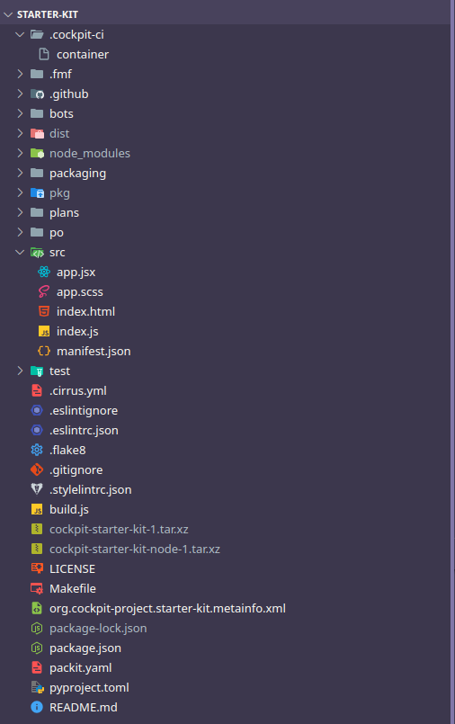

# Writing your first Cockpit application

Cockpit is a one to one web manager developed by redhat. Its designed to be highly extensible using applications. Applications are what the upstream cockpit project calls plugins. Applications are written in Javascript and use React with as the UI framework. To simplify the development process the upstream project uses [PatternFly](https://www.patternfly.org) as a React component library. 

## Theory

### What is a component library or a component for that matter?

Seeing as many reading this are not Javascript developers, I'll be going over some react concepts here. We can think of a React application as being built up on smaller components. Each component can be though of as a small building block. Running its own code and being more or less isolated from everything else. React components are written in JSX. JSX is a extension of javascript that allows mixing html and javascript. A simple JSX element would be

```jsx
const element = <h1>Hello, world!</h1>;
```

Initially it looks a bit weird(especially if you have written pure javascript and html) but as you write more JSX you will feel more comfortable with writing JSX. Since components are just javascript we can export them from files and import them into other allowing them to be reused across your project. PatternFly does exactly that, provide components that we can reuse in our project. These components include css so we don't need to worry about styling our components instead we can just use the Patternfly ones.

### Understanding cockpit internals.

Cockpit is made up of a few moving parts but, from the perspective of a applications developers cockpit is just a regular http/websocket server. While websockets can be diffcult to work with, cockpit simplifies our approach with cockpit.js. Cockpit.js handles all the websocket management and messages in websocket connection. Cockpit.js allows us to interact with files(read, write, watch for changes), dbus apis, and run commands.


## Practice

### Getting ready to develop a cockpit application

Before we can continue we need to get our system ready for developing a cockpit application. I will assume you are running OpenSuse tumbleweed as the cockpit.js api may be different on cockpit. We will need a nodejs runtime, the npm package manager, git, make, as well as cockpit development files. To install all of this we can use the opensuse repo. You may consider using nvm to manage nodejs if you prefer that method. I will assume if you are using nvm, you know what to do. If you do not the following command should install all the required dependencies.

```sh
$# zypper in nodejs npm git cockpit-devel make
```

### Starterkit, our best friend in cockpit application development

Starter kit is a repository on github that, provides all the boiler plate required to get started with cockpit development. We can get started with development by simply fetching the repo using git.

```sh
$ git clone https://github.com/cockpit-project/starter-kit.git
```

Now we have to install our nodejs dependencies this is simply achieved with `npm i`. Now if you were to open this project in a code editor with LSP support you will get errors about missing imports as the development files are missing as they are provided by `cockpit-devel`. To fetch the development files we can run `make`. From here we can open the folder in our prefer code editor. I will be using vscode, and screenshots will reflect the same. At this point we can take a look at the `src/` folder.




This is the first part, you can play around and try and figure out how things go from here or follow along in the second part.