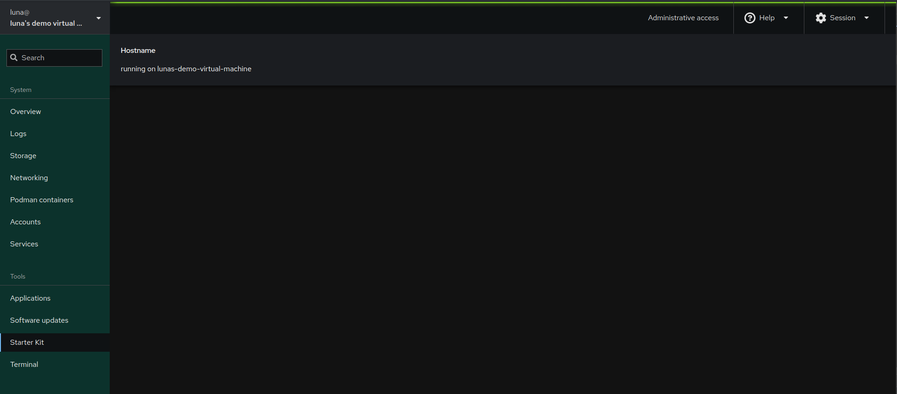

# Patternfly: how to make your application look better with minimal effort


So far we've worked using bare jsx. It looks extremely bare bones and has no structure. Lets start with where we left off. 

```jsx
import React from "react";
import cockpit from "cockpit";

export const Application = () => {
    const [hostname, SetHostname] = React.useState("");

    React.useEffect(() => {
        cockpit.spawn(["cat", "/etc/hostname"])
                .then(stdout => SetHostname(stdout))
                .catch(() => SetHostname("There was an error reading /etc/hostname"));
    }, []);

    return <p>{`hostname: ${hostname}`}</p>;
};
```

Before we continue without code I'll be introducing what patternfly is. Patternfly is a component library. We created a component when we defined `Application`.  Components are reusable bits of React code that allow us to simplify code. Lets look at a simple React component

```jsx
function Greet({name}) {
    return <h1>`hello ${name}`</h1>
}
```

Here we have a simple component to say "hello ${name}" where name is provided. We can go a step futher and use it from another component.

```jsx

export function App() {
    return <Greet name="Luna" />
}
```
This essentially allows us to reuse components. We could go a step further than reusing in a project and instead have a libarary of generic reusable components. That is what Patternfly is. This isn't the only component library, MaterialUi and ReactBootsrap. We'll now go back to the original code and import some components from `patternfly`.

```jsx
import { Card, CardTitle, CardBody } from '@patternfly/react-core';
```

This import a set of components `Card`, `Cardtitle` and `CardBody`. Card, is a rectangular container that can contain any kind of content. A large amount of the dashboard is built using `Card`. Lets start modifying the component to use them. At the end of the `Application` component there is a return statement. We will change it to be

```jsx
return (
        <Card>
            <CardTitle>Hostname</CardTitle>
            <CardBody>running on {hostname}</CardBody>
        </Card>
    );
```

We we deal with JSX we work with javascript inside of the html using `{}` in the previous return statement ```return <p>{`hostname: ${hostname}`}</p>;``` we used `${}` as we were dealing with a templete string. Lets take a look at how out component will look like now. If you used the `make devel-install` command you will only need to run `npm run build`.




lets play a little with the cockpit api before we end this section. Currently we are using cat to read the file which creates a implicity depency on coreutils, and will never change if our hostname changes. Cockpit provides an api for interacting with files doing the basics of read, write and watch as well as some more complex functionaly like atomic modifications. We will be using the watch functionality. We will replace the code inside useEffect with 

```jsx
cockpit.file("/etc/hostname")
    .watch((content) => {
        if (content) {
            SetHostname(content);
        }
    });
```

Now, we use cockpits internal api to read the file and watch for chanages. The benfits to this approach include, no extrenal depencies. We get the content of the `/etc/hostname` as it changes amongst many other benfits. We'll end of here and look into more advance uses of the cockpit api, and make a "better" hostname application along with. At this point your code should look like.

```jsx
import React from "react";
import cockpit from "cockpit";

export const Application = () => {
    const [hostname, SetHostname] = React.useState("");

    React.useEffect(() => {
       cockpit.file("/etc/hostname")
            .watch((content) => {
                if (content) {
                    SetHostname(content);
                }
            });
    }, []);

    return (
        <Card>
            <CardTitle>Hostname</CardTitle>
            <CardBody>running on {hostname}</CardBody>
        </Card>
    );
};
```